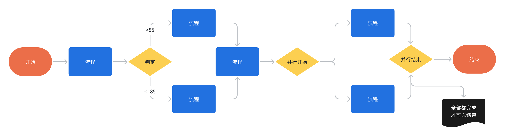

# workflow

## 1. `workflow`是什么

谈到流程引擎，当前市面上大部分是Activiti、Flowable、Camunda等面向OA场景，
功能强大且有比较完整的生态的工作流引擎（平台），同时因为OA复杂的场景，库表关联操作非常多，
但是对于其它业务场景，引擎运维以及学习成本较高，性能不可避免有一定损失，
在于其他业务结合这块需要做的工作也非常多,不适用于C端场景。 

`workflow`是一个非常轻量、高性能、可集成、可扩展的纯内存流程引擎，支持并行网关、排它网关。

`workflow`能让开发人员通过配置Yaml实现自己的业务流程，将复杂的业务逻辑可视化，为业务设计人员与开发工程师架起了一座桥梁。

## 2. Design Intention

1. 希望为业务开发提供端至端，从设计至实现的业务流程解决方案。
2. 提供多种流程引擎，实现从战略至商业能力，商业能力至业务流程，业务流程至系统，并最终实现业务的可视化全局架构。
3. 设计高效的执行引擎，实现对服务的快速组合或扩展，提升`idea`至`value`的研发响应与交互速度。

## 3. Features

1. 高性能：纯内存操作，业务系统只要记录状态即可.
2. 丰富的应用场景：可用在流程审批、交易、履约、资金等多个业务场景。
3. 可集成：轻量、简洁的设计使得可以极其方便地集成到各个解决方案和业务场景中。

## 4. Quick Start

### 使用demo

https://github.com/654894017/workflow/tree/master/src/test/java/com/damon/workflow/complex

